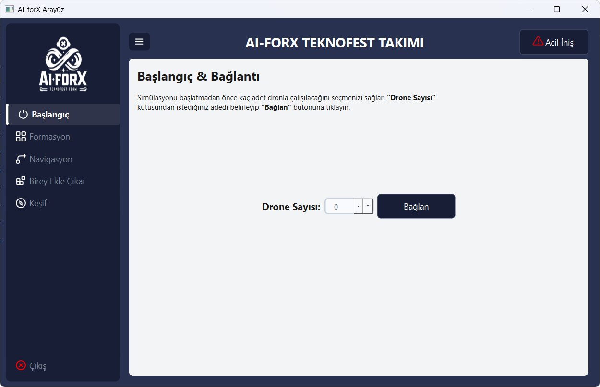
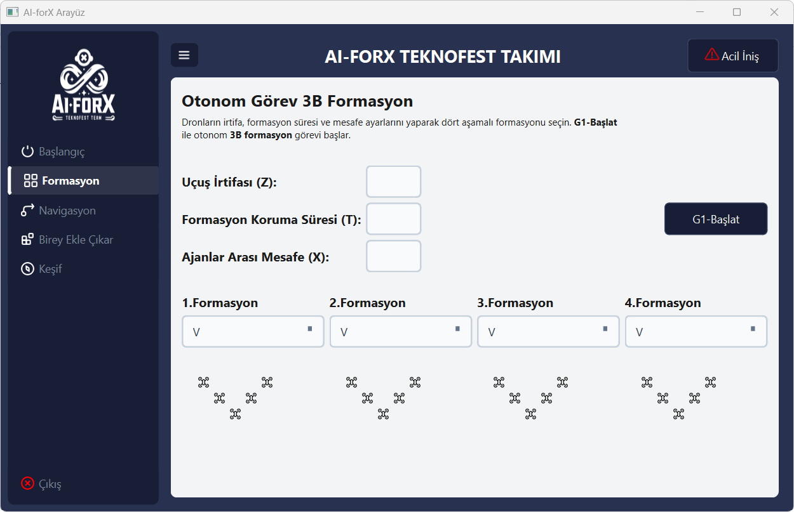
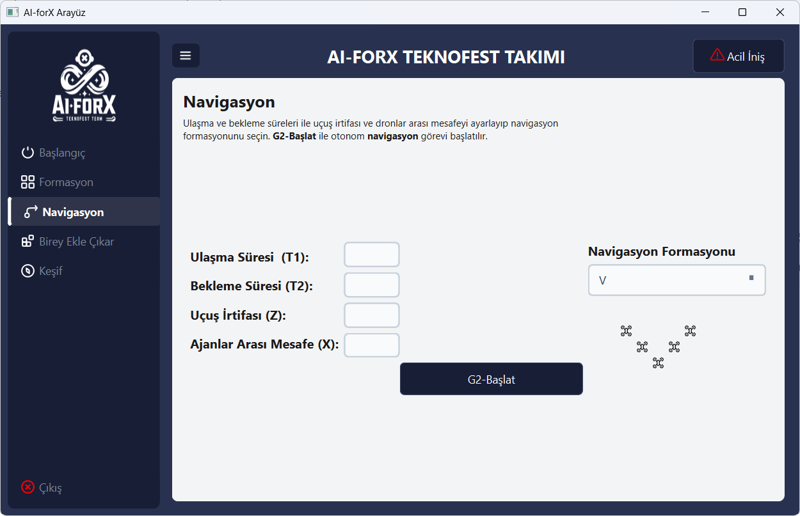
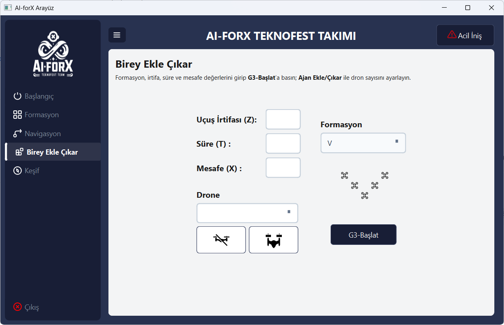
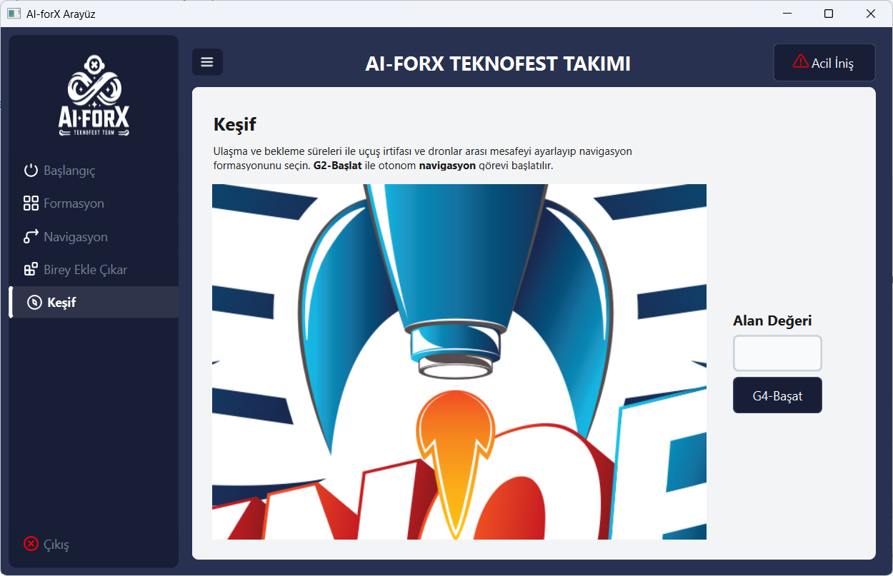

# AI-ForX Sürü İHA ve Keşif Kontrol Arayüzü

Bu proje, Sürü İHA (İnsansız Hava Aracı) sistemleri için geliştirilmiş, keşif ve yönlendirme görevlerini yönetmeyi sağlayan modern bir yer istasyonu arayüzüdür. **Python** ve **PySide6** (Qt) kullanılarak geliştirilmiş olup, **OpenCV** entegrasyonu ile İHA kameralarından gelen canlı görüntüleri işleyebilmektedir.

> **Önemli Not:** Teknofest yarışması kapsamındaki gizlilik ve rekabet kuralları gereğince, bu depoda yalnızca **arayüz tasarımı ve ön yüz işlevleri** paylaşılmıştır. Arayüzün arka planında çalışan **sürü İHA simülasyon kodları ve gerçek drone (otonom uçuş) kodları** paylaşılmamıştır.

<br>

## Tanıtım Videosu

Kullanıcı arayüzünün genel kullanımı ve özelliklerine ait tanıtım videosu:

<video src="./images/Video.mp4" controls="controls" style="max-width: 100%;"></video>

<br>

## Özellikler ve Ekran Görüntüleri

### 1. Bağlantı ve Başlangıç
İHA sistemleriyle bağlantı durumu kontrolü ve başlangıç parametrelerinin (drone sayısı vb.) yapılandırılması.



### 2. Sürü Formasyonu
İHA sürüsünün uçuş formasyonlarının düzenlenmesi ve yönetimi.



### 3. Navigasyon
Sürünün harita ve konum tabanlı yönlendirilmesi.



### 4. Birey Yönetimi
Sürüye aktif olarak yeni İHA ekleme veya sistemden çıkarma işlemleri.



### 5. Keşif (Reconnaissance) Modülü
- Belirtilen alan büyüklüğü ve sürüdeki drone sayısına bağlı olarak **otomatik tarama süresi hesaplama**.
- OpenCV kullanılarak **eşzamanlı canlı kamera akışı** takibi (Drone 1, Drone 2 vb. etiketleme ile).
- Taramadaki ilerleyişin anlık olarak görsel bir ilerleme çubuğu (Progress Bar) üzerinden takibi.



**Not:** Arayüz genelinde karanlık tema (dark mode) ve özel ikonlarla zenginleştirilmiş, kullanıcı dostu dinamik menü geçişleri mevcuttur.

<br>

## Kullanılan Teknolojiler

- **[Python 3](https://www.python.org/)**: Temel programlama dili.
- **[PySide6 (Qt for Python)](https://doc.qt.io/qtforpython/)**: Grafiksel kullanıcı arayüzü (GUI) ve uygulama döngüsü.
- **[OpenCV (`opencv-python`)](https://opencv.org/)**: Gerçek zamanlı kamera ve görüntü işleme algoritmaları.

## Proje Yapısı

```text
├── main.py            # Ana uygulama döngüsü, sinyal/slot bağlantıları ve kamera algoritmaları
├── arayuz.ui          # Qt Designer ile oluşturulmuş ham arayüz tasarım dosyası
├── arayuz.py          # arayuz.ui dosyasından dönüştürülmüş arayüz sınıfı
├── resource.qrc       # İkonlar ve görseller için kaynak listesi
├── resource_rc.py     # Derlenmiş kaynak dosyası (Python formatında)
├── run.bat            # UI ve QRC dosyalarını Python'a dönüştüren derleme betiği
├── icon/              # Arayüzde kullanılan SVG/PNG formatındaki ikonlar
└── images/            # README dosyasında kullanılan ekran görüntüleri ve videolar
```

<br>

## Kurulum ve Çalıştırma

### Gereksinimler
Sistemin çalışması için Python yüklü olmalı ve gerekli kütüphaneler kurulmalıdır. Bağımlılıkları kurmak için terminalinizde aşağıdaki komutu çalıştırın:

```bash
pip install PySide6 opencv-python
```

### Uygulamayı Başlatma
Uygulamayı direkt olarak `main.py` üzerinden başlatabilirsiniz:

```bash
python main.py
```

### Arayüzde Değişiklik Yapma (Geliştiriciler İçin)
Eğer `arayuz.ui` dosyasında Qt Designer ile bir değişiklik yaparsanız veya `icon/` klasörüne yeni ikonlar eklerseniz, bu değişiklikleri kod tarafına aktarmak için derleme işlemini yapmalısınız. 

Bunun için proje dizininde yer alan `run.bat` dosyasını çalıştırabilirsiniz:

```powershell
.\run.bat
```
*(Bu dosya `pyside6-uic` ve `pyside6-rcc` komutlarını çalıştırarak arayüz ve kaynak kodlarını otomatik olarak günceller.)*
